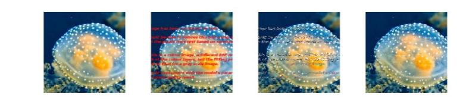

# Image RBF regression

This code addresses images with missing or corrupted pixels, such as the example below, affected by red text, and endeavors to rectify the issue. 
The process involves employing RBF regression to predict and restore the corrupted pixels.

